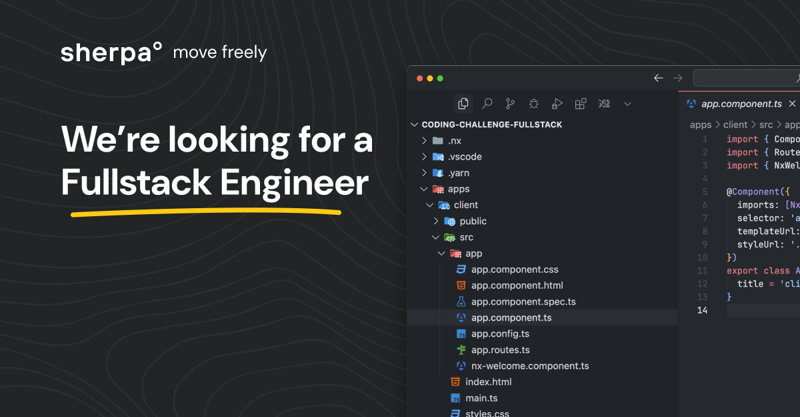

# 🌎 Fullstack Engineer Coding Challenge

## Backend APIs created for:

- Browse all visa products (with pagination and filtering)
- View individual product details
- Edit product information
- Create new products

## 🚦 Getting Started

Quick setup:

```
npm i -g yarn # if you don't have yarn installed
yarn
```

Generate Prisma Client: (Prisma ORM for easy CRUD operation with PostgreSQL database)

```
cd apps/server
npx prisma generate
```

Running the application:

```
npx nx run server:serve
```
Please note that you would need an .env file with DATABASE_URL placed inside server app

Running the tests:

```
npx nx run server:test  
```

### API Documentation:

Once the backend app(server) is running, the API documentation is available at [http://localhost:3000/api-docs](http://localhost:3000/api-docs)

View Postman documentation at: [https://documenter.getpostman.com/view/18287565/2sAYkBth9J](https://documenter.getpostman.com/view/18287565/2sAYkBth9J)

View OpenAPI Schema here: [https://github.com/JaySonani/Visa-Products-API/blob/main/apps/server/openAPI/schema.yaml](https://github.com/JaySonani/Visa-Products-API/blob/main/apps/server/openAPI/schema.yaml)